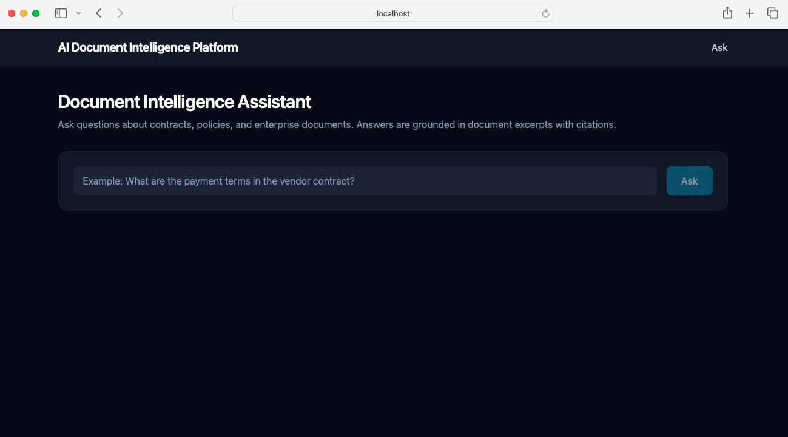
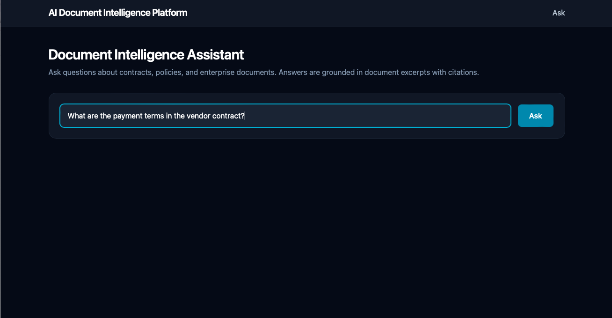
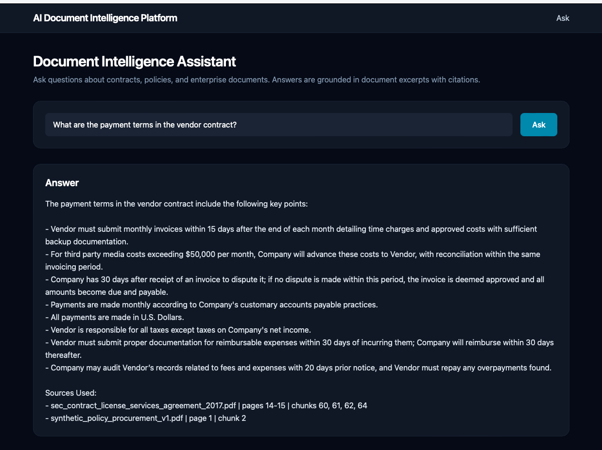
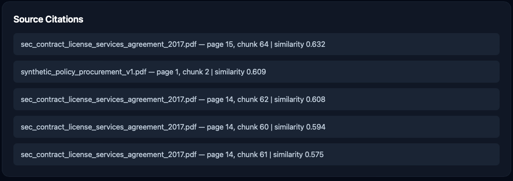
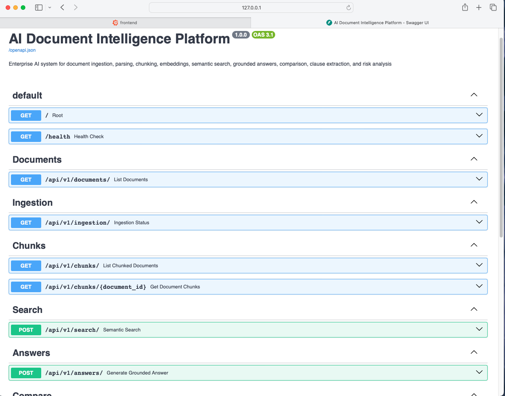
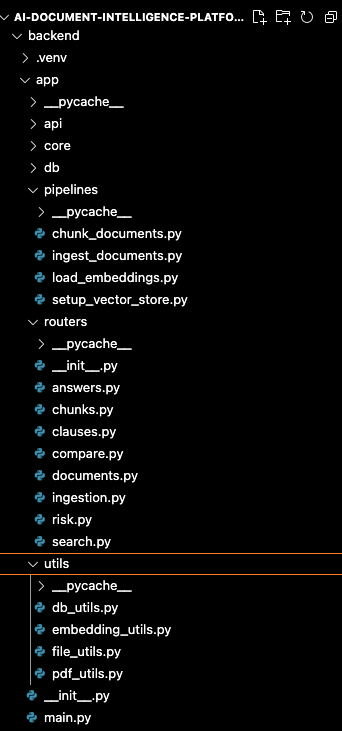

# AI Document Intelligence Platform

An enterprise-style AI system that enables users to ask questions about internal documents using semantic search and grounded LLM responses.

The system processes PDFs, generates embeddings, stores them in a vector database, and retrieves relevant document excerpts to produce explainable AI answers with citations.

---

## Features

- Document ingestion and chunking
- Embedding generation
- Vector search using pgvector
- Retrieval-augmented generation (RAG)
- Source citations for explainability
- FastAPI backend
- React + Tailwind frontend

---

## Architecture

Document → Chunking → Embeddings → pgvector → Retrieval → LLM → UI

---

## Tech Stack

Backend
- Python
- FastAPI
- PostgreSQL
- pgvector
- OpenAI API

Frontend
- React
- TypeScript
- TailwindCSS
- Vite

Infrastructure
- Docker
- Vector database
- REST API

---

## Screenshots

### Application Interface

### AI Question input

### AI Generated Answer

### Retrieval Confidence

### Source Citations

### API Documentation

### Project Structure

---

## Running the Project

### Start Backend

